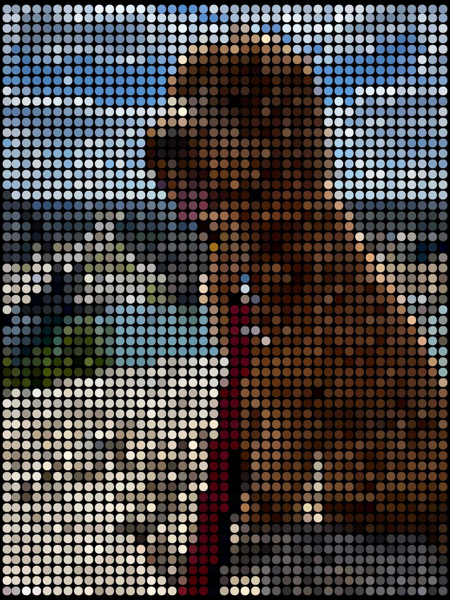

# Image Bubbler
Takes images and "bubbles" them by converting it to an array of colored cirlces. Can add a cool effect on an image and also be used for anonymity.
### Example:
Original            |  Bubbled
:------------------:|:----------------------:
  |  

## Requirements
- python3
- numpy
- opencv-python

## Usage
```
python3 img_bubbler.py <source_image>
```
Two windows will pop up, one containing the bubbled image with default parameters and one containing 3 trackbars to change these parameters. 

- **Circle Radius** Adjusts the circle's radius
- **Circle Spacing** Adjusts the space between the circles
- **Brightness** Changes the color of the background from black -> gray -> white

The window with the image will stay open and wait for one of 3 key presses:

- **Spacebar** Updates the image with the current parameters from the slider window. The image does *not* automatically update in the window, so make sure to hit space after making changes.
- **s** Prompts a save location in the terminal and attempts to save the current image at that location
- **Esc** Closes all windows and exits the program. Will print the final circle radius and spacing in the terminal